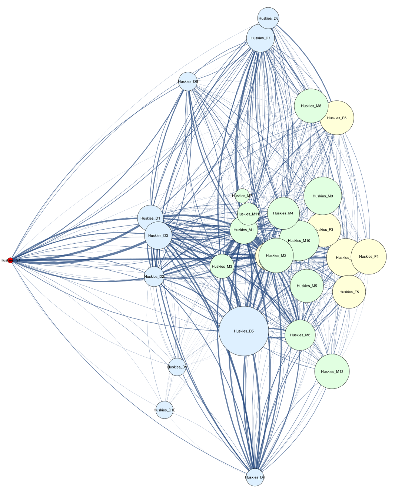
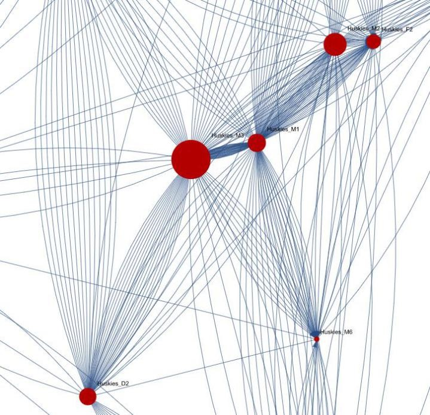
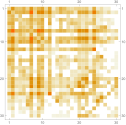

# ICM 2020 D Data Analysis

## The Model

### Notations

|    H    |      The set of all team members      |
| :------: | :------------------------------------: |
|    F    |   The set of all forwards in a team   |
|    M    |   The set of all midfields in a team   |
|    D    |   The set of all defenses in a team   |
|    G    |  The set of all goalkeepers in a team  |
| card (S) |         The order of the set S         |
|   A-B   | The difference between set A and set B |
|   PASS   |             Passing event             |

### Preliminary

According to the data in the file "passing event", we can deduce that
Huskies has 6 forward, 13 midfield, 10 defense, and a goalkeeper. We
describe them, in a mathematical language, as four sets as following:

$$
F = { F_{i}\ |\ 1 \leq i \leq 6 }
$$

$$
M = { M_{i}\ |\ 1 \leq i \leq 13 }
$$

$$
D = { D_{i}\ |\ 1 \leq i \leq 10 }
$$

$$
G = { G_{1} }
$$

Since *H* represents the set which contains all the players of
Huskies, we have:

$$
H = F \cup M \cup D \cup G
$$

Let's assume there are $P_{j}$ times of passing in the j'th match $(1 \leq j \leq 38)$. If the k'th $\left( 1 \leq k \leq P_{j} \right)$ passing is between player X to player Y (originated from player X), we denote this passing event as $PASS_{jk}(X,Y)$ , here $X \neq Y$ . If we don't emphasis who is the origional player, we may denote it as $PASS_{jk}$.

In order to show player X's number of passing in the j'th match $(1 \leq j \leq 38)$, we consider the set

$$
PASS_{j}\lbrack X\rbrack = { P_{jk}(A,B)\ |A \neq B,A = X\ \text{or}\ B = X,\text{where } A,B \in H }
$$

Then the order of the set $PASS_{j}\lbrack X\rbrack$, namely $card\left( PASS_{j}\lbrack X\rbrack \right)$, represents how many passings player X has operated in the j'th match.
It is not difficult to see that we can rewrite $P_{j}$ as
$\sum_{X \in H}^{}{card\left( PASS_{j}\lbrack X\rbrack \right)}$.

For each player X, we denote the mean coordinate of X, when every
$P_{jk}(A,B) \in PASS_{j}\lbrack X\rbrack$,
as $\left( x_{P_{jk}(A,B)},y_{P_{jk}(A,B)} \right)$.

By using these notations, we conduct following operations on the
coodinates in all 38 matches:We consider the mean coordinate of every
Huskies players X.

$$
\begin{array}{l}\overline{x(X)}=\frac{\sum_{j=1}^{38} \sum_{P_{j k}(A, B) \in PASS_j[\mathrm{X}]} x_{P_{j k}(A, B)}}{\sum_{j=1}^{38} card\left(PASS_j[X]\right)} \\ \overline{y(X)}=\frac{\sum_{j=1}^{38} \sum_{P_{j k}(A, B) \in PASS_j[\mathrm{X}]} y_{P_{j k}(A, B)}}{\sum_{j=1}^{38} card\left(PASS_j[X]\right)}\end{array}
$$

So we can get the mean coordinate distance between player A and player
B:

$$
\overline{d}\left\langle A,B \right\rangle = \left\lbrack \left( \overline{x(A)} - \overline{x(B)} \right)^{2} + \left( \overline{y(A)} - \overline{y(B)} \right)^{2} \right\rbrack^{\frac{1}{2}}
$$

For each player X, we define his defense range $R(X)$ in all 38
matches as follow:

$$
R(X) = \sqrt{\frac{\sum_{j = 1}^{38}{\sum_{P_{jk}(A,B) \in PASS_{j}\lbrack X\rbrack}^{}\left\lbrack \left( x_{P_{jk}(A,B)} - \overline{x(X)} \right)^{2} + \left( y_{P_{jk}(A,B)} - \overline{y(X)} \right)^{2} \right\rbrack}}{\left\lbrack \sum_{j = 1}^{38}{card\left( PASS_{j}\lbrack X\rbrack \right)} \right\rbrack - 1}}
$$

In fact, this is the geometric mean of the sum of the variance of the
horizontal coordinates and vertical coordinates of player X in all 38
matches, which represents the fluctuation of player X's position in
the match.

We plot every coordinate of Huskies players $X$ by pointing out the
point $\left( \overline{x(X)},\overline{y(X)} \right)$ on
$\lbrack 0,100\rbrack \times \lbrack 0,100\rbrack$, the subset of
$R^{2}$ plane, and for each
$P_{jk}(A,B) \in PASS_{j}\lbrack X\rbrack$, we connect A,
B with directed curve segments $\lbrack 3\rbrack$. The specific rules are
as following:

- In order to represent the frequency of passing between player A and
  player B in all 38 matches, the width of the curve is proportional
  to

$$
\sum_{j = 1}^{38}{card\left( PASS_{j}\lbrack A\rbrack \cap PASS_{j}\lbrack B\rbrack \right)}
$$

- Make a circle with the player X as the center and the defense range
  $R(X)$ as the radius at each player.
- We color people in different positions. We use yellow to represent
  the forward, green to represent the midfield, blue to represent the
  defense and red to represent the goalkeeper.

### Structural Indicators and Network Patterns

#### Structural Indicators

In order to represent the scale of interaction between every
individuals and the whole team, we define "the indicator of unity" by
calculating the variance of each member's number of passing
$\sum_{j = 1}^{38}{card\left( PASS_{j}\lbrack X\rbrack \right)}$.
Firstly we consider the average passing frequency of all 38 matches

$$
\frac{\sum_{X \in H}^{}{\sum_{j = 1}^{38}{card\left( PASS_{j}\lbrack X\rbrack \right)}}}{card(H)}
$$

and then we get the variance of each member's number of passing:

$$
U = \frac{\sum_{X \in H}^{}\left( \sum_{j = 1}^{38}{card\left( PASS_{j}\lbrack X\rbrack \right)} - \frac{\sum_{X \in H}^{}{\sum_{j = 1}^{38}{card\left( PASS_{j}\lbrack X\rbrack \right)}}}{card(H)} \right)^{2}}{card(H)}
$$

We denote U as the indicator of unity of a team.

It's obvious that U reflexes how "united" the whole team is. The
smaller U is, so does the deviation of every player's passing numbers
and more similar the character played by every player.

Now we consider the distribution of distance. For the initial and end
coordinates of each pass, say $\operatorname{Point}_{1}\left( x_{1},y_{1} \right)$, $\ \operatorname{Point}_{2}\left( x_{2},y_{2} \right)$,
we use the Euclidean norm to describe the distance:

$$
d\left\langle \operatorname{Point}_{1},\operatorname{Point}_{2} \right\rangle = \sqrt{\left( x_{1} - x_{2} \right)^{2} + \left( y_{1} - y_{2} \right)^{2}}
$$

By counting the distribution of the passing distance between all team
players, we may get

It's easy to observe that the distance which the players of Huskies like
most are 12-20, which means that the main passing strategy of Huskies is
mid-range simple pass and the relative distance of players while passing
is comparatively close. It's also very obvious that the whole curve is
very similar to the Poisson distribution, which is often used to
describe the occurring of random events in a period of time.

For the average coordinate distance between player A and player B, we
can compare the number of times that this distance appears in the entire
game with the distribution of all passing distances, say $\sharp\overline{d}\left\langle A,B \right\rangle$. We will use this
indicator to give the definition of distance factor $\operatorname{Dis}(A,B)$.

#### Network Patterns

By studying the topology porperties of the network, the
passing network of whole team** with mathmetica, we may extract all the
dyadic and triadic patterns from the whole figure. We conclude 3 most
common configurations of dyadic and triadic among all patterns
respectively and calculate the exact number of their appearance(see
Table. 1 ).

### α-Players Optimization Model

#### Extra Symbols

Signs and definitions indicated above are still valid. Here are some
extra signs and definitions.

$N^{H}$ the number of matches which H is involved

${C(n)}_{i}$ the ith n-polybasic configuration

$T_{C(n)}$ the set consisting of all n-polybasic configuration

$T_{C}$ the set consisting of all $T_{C(n)}$

${{C(n)}_{i}}_{j}$ the ith n-polybasic configuration in the
j'th competition

$\sigma_{A}^{j}$ the Betweenness Centrality of player A in the j'th
competition

$\sum{\mathrm{\Delta}t_{j}}$ the team's total duel
time in j'th match

$\operatorname{FLOW}_{j}$ the flow, the sum of mean passing time
and duel time in the j'th competition

$\tau(A,B)$ the cooperation indicator of player A and B

$\alpha$ the football formation(decided by the coach)

$\alpha_{F}$ the number of forwards in football formation $\alpha$

$\alpha_{M}$ the number of midfield players in football formation $\alpha$

$\alpha_{D}$ the number of defense players in football formation $\alpha$

$\theta(F,X)$ the number assigned to player X in F

$\theta(M,X)$ the number assigned to player X in M

$\theta(D,X)$ the number assigned to player X in D

$\theta(H,X)$ the number assigned to player X in H

$Z(A)$ Boolean function, where A is a player

#### Frequency of Polybasic Configuration

Let's do some preparation before giving the definition formally:

According to the data analysis on $N_{H}$ matches, we may conclude
$l(n)$ different n-polybasic configurations, denoted as

$$
T_{C(n)} = { {C(n)}_{1},{C(n)}_{2},\ldots,{C(n)}_{l(n)} }\left( 1 \leq n \leq card\left( T_{C} \right) \right)
$$

Beware, the n-polybasic configurations is different from the dyadic or
triadic patterns. The importance of the concept of
n-polybasic configurations lies in that it must be continuous about
time while the latter one doesn't have to, which makes it more
effective when discribing the strategy of the team. We calculate the
distribution of all n-polybasic configurations in 38 matches and we
list them here.

Since $P_{jk}(A,B)$ means that the k'th passing in the j'th
match is from player A to player B. According to the definition, it's
not so hard to observe that the whole passing number of each player A
is

$$\sum_{j = 1}^{N^{H}}{card\left( PASS_{j}\lbrack A\rbrack \right)}$$

For every fixed player A and B, for each match(here we denote as j'th
match), for every ${C(n)}_{i} \in T_{C(n)}$, we may calculate the
number of elements of ${{C(n)}_{i}}_{j}$ and ${{C(n)}_{i}}_{j}^{A \bigcap B}$ in the j'th match.

Then, we will define the ratio

$$
\frac{\sum_{j = 1}^{N^{H}}{\sum_{n = 1}^{card\left( T_{C} \right)}{\sum_{i = 1}^{l(n)}{{C(n)}_{i}}_{j}^{A \bigcap B}}}}{\sum_{j = 1}^{N^{H}}{\sum_{n = 1}^{card\left( T_{C} \right)}{\sum_{i = 1}^{l(n)}{{C(n)}_{i}}_{j}}}}
$$

as the frequency of polybasic configuration, which, simply speaking,
means how "common" the $C(n)_{i}$, which possesses A and B as
elements, is among all $C(n)_{i}$ s.

#### The Betweenness Centrality of Players

Betweenness Centrality is the ratio of the shortest
path that passes through a point and connects the two points to the
total number of shortest path lines between the two points. The
greater the betweenness centrality of a player, the more important the
role of this player in the entire passing network, that is, this
player can be regarded as a core member. We choose a specific match to
show the Betweenness Centrality directly. The radius of
each player's node shows his BC in that specific match.

Now we may calculate the sum of Betweenness Centrality of player A and
player B in this specific match: $\sigma_{A}^{j} + \sigma_{B}^{j}$.

Here we use the result of the expression

$$
\frac{\sum_{j = 1}^{N^{H}}{\sum_{n = 1}^{card\left( T_{C} \right)}{\sum_{i = 1}^{l(n)}{{C(n)}_{i}}_{j}^{A \bigcap B}}}}{\sum_{j = 1}^{N^{H}}{\sum_{n = 1}^{card\left( T_{C} \right)}{\sum_{i = 1}^{l(n)}{{C(n)}_{i}}_{j}}}}*\left( \sigma_{A}^{j} + \sigma_{B}^{j} \right)
$$

To show how "practical" the strategy formed
by player A and B is. Indeed, in order to explain the strongness of a
specific combination, we should not only consider the frequency of the
appearance of it but also take the number of "core" players involved
into account and this product shows such an ideal. **Distance and
Diversity Factors**

Here is the definition of the Distance Factor $\operatorname{Dis}(A,B)$ for
player A and player B:

$$
\operatorname{Dis}(A, B)=\frac{\sharp \bar{d}\langle A, B\rangle}{\sum_{A \in H} \sum_{j=1}^{N^H} card\left(PASS_j[A]\right)}
$$

This definition expresses whether the passing distance between A and B
is "usual" among all the passing events of the whole team. It's apparent
that the more "normal" the distance between player A and B is, the
easier their passing will be. This indicator shows the property of
symmetric. The deeper the color, the
bigger the number.

Next, let\'s count the number of times that player A uses simplepass
in the j\'th match as $\operatorname{simple}(A,j)$.

Here is the definition of the diversity factor $\operatorname{Div}(A)$ for
player A:

$$
\operatorname{Div}(A) = 1 - \frac{\sum_{j = 1}^{N^{H}}{\operatorname{simple}(A,j)}}{\sum_{j = 1}^{N^{H}}{card\left( PASS_{j}\lbrack A\rbrack \right)}}
$$

Obviously, this indicator describes the diversity of the player A's
style. If a player tend to play unpredictably, the proportion of
simple passing in his data will be very low and this indicator will
become pretty high.

#### Team level process

There are many team level process indicators in the match, such as the
flexibility and the adaptability of a team. Here, we introduced the
indicator of the flow of a team which is consist of
the sum of average time of passing and dueling, and is defined as
follow:

$$
\operatorname{FLOW}_{j} = \frac{\sum{\mathrm{\Delta}t_{PASS}}}{\sum_{A \in H}^{}{\sum_{j = 1}^{N^{H}}{card\left( PASS_{j}\lbrack A\rbrack \right)}}} + \frac{\sum{\mathrm{\Delta}t_{j}}}{card\left( \operatorname{Duel} \right)}
$$

#### The Indicator of Cooperation

Now, we give out the complete definition of the Cooperation Indicator
between player A and B:

$$
\tau(A, B)=\operatorname{Dis}(A, B) * \operatorname{Div}(A) * \operatorname{Div}(B) \sum_{j=1}^{N^H} \sum_{i=1}^l\left[\frac{\sum_{j=1}^{N^H} \sum_{n=1}^{card\left(T_C\right)} \sum_{i=1}^{l(n)} C(n)_{i j}^A{ }^A B}{\sum_{j=1}^{N^H} \sum_{n=1}^{\operatorname{car}\left(T_C\right)} \sum_{i=1}^{l(n)} C(n)_{i j}} *\left(\sigma_A^j+\sigma_B^j\right) * \mathrm{FLOW}_j\right]
$$

Obviously, $\tau(A,B)$ possesses a porperty of symmetrical, which
means:

$$
\tau(A,B) = \tau(B,A)
$$

If $A = B$,we set $\ \tau(A,A) = 0$ since A cannot cooperate with
himself.

So we got the following symmetric matrix describing the cooperation of
indicator of the players:

$$
\begin{pmatrix}
0 & \cdots & \tau\left( A_{1},A_{card(H) - card(G)} \right) \\
 \vdots & \ddots & \vdots \\
\tau\left( A_{card(H) - card(G)},A_{1} \right) & \cdots & 0 \\
\end{pmatrix}
$$

#### α-Players Optimization Model

As in general football teams, there is only one goalkeeper without
backups and he attend every match. Besides, given that there's not
much of goalkeeper's influence on the team's "cooperation indicator",
we decide not to add the goalkeeper in our model. Here we form a 0-1
integer programming with optimizing.

In order to model more efficiently, we re-number the elements in the
set $F \bigcup {M \bigcup D}$ in the following rules:

- If $X \in F$, then the numbers of $x$ equal to the numbers of $x$ in
  set F
- If $X \in M$, then the numbers of $x$ equal to the numbers of $x$ in
  set M +$card(F)$
- If $X \in D$, then the numbers of $x$ equal to the numbers of $x$ in
  set D + $card(F) + card(M)$

According to our symbols, we have

$$
\theta(H, X) \begin{cases}
\theta(F, X) & X \in F \\
\theta(M, X)+\operatorname{card}(F) & X \in M \\
\theta(D, X)+\operatorname{card}(F)+\operatorname{card}(M) & X \in D
\end{cases}
$$

Thus we have $1 \leq \theta(H,X) \leq card(H) - card(G)$. In this way,
we got a one-one mapping between $F \bigcup {M \bigcup D}$ and
positive integer set
${ 1,2,\ldots,card(H) - card(G) }$.

Hence $H - G$ can be rewritten as
${ A_{\theta(H,A)} }$,i.e.
${ A_{i} }_{i = 1}^{card(H) - card(G)}$.

Thus for each $1 \leq i \leq card(H) - card(G)$, Boolean
function Z has the value

$$
Z_i=Z\left(A_i\right)= \begin{cases}1 & \text { select player A to participate in the match } \\
0 & \text { otherwise }\end{cases}
$$

That is, if the player whose number is positive integer
$i\left( 1 \leq i \leq card(H) - card(G) \right)$ shows up in the
match, then we let $Z_{i} = 1$. Otherwise, $Z_{i} = 0$.

For the formation α that the coach has specified, we establish the
following α-Players Optimization Model:

$$
\max \sum_{s=1}^{card(H)-card(G) card(H)-card(G)} \sum_{t=1} Z_s * Z_t * \tau\left(Z_s, Z_t\right)
$$

$$
\begin{cases}
\sum_{i=1}^{card(F)} Z_i&=\alpha_F \\
\sum_{i=1+card(F)}^{card(F)+card(M)} Z_i&=\alpha_M\\
\sum_{i=1+card(F)+card(M)}^{card(H)-card(G)} Z_i&=\alpha_D \\
Z_i \in\{0,1\}(1 \leq i \leq card(H)-card(G))
\end{cases}
$$

where

$$
\tau\left(Z_s, Z_t\right)=
\operatorname{Dis}\left(A_s, A_t\right) * \operatorname{Div}\left(A_s\right) * \operatorname{Div}\left(A_t\right) \sum_{j=1}^{N^H} \sum_{i=1}^l\left[\frac{\sum_{j=1}^{N^H} \sum_{n=1}^{card\left(T_C\right)} \sum_{i=1}^{l(n)} C(n)_{i j}^{A_s \cap A_t}}{\sum_{j=1}^{N^H} \sum_{n=1}^{c \operatorname{ard}\left(T_C\right)} \sum_{i=1}^{l(n)} C(n)_{i j}} *\left(\sigma_{A_s}^j+\sigma_{A_t}^j\right) * \operatorname{FLOW}_j\right]
$$

So we just need to find the optimal solution for this model:

$$
\left(Z_{1}^{\star}, Z_{2}^{\star}, \cdots, Z_{card(H)-card(G)^{\star}}\right)
$$
