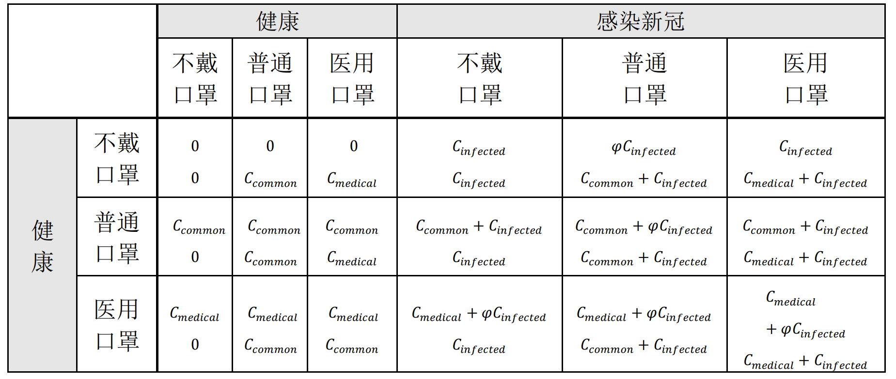
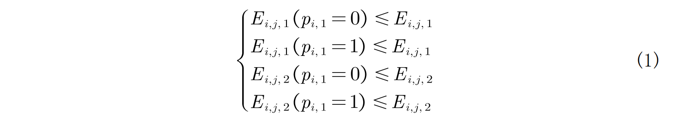
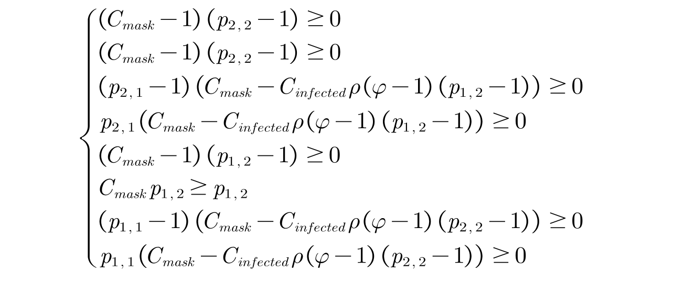

# 新冠疫情下的博弈

摘要

以下为2020年初, 单纯结合口罩和疫情的社会背景下的一个博弈论相关内容的应用. 假设和内容都是理想化且一定程度脱离现实, 因此结论不具有任何实际价值和意义.

本文主要探讨在疫情初期国外关于健康的人是否要戴口罩以及国内政府是否选择限价口罩的问题背后所蕴含的博弈. 并对这两个事件分别建立模型, 通过得到那什均衡解分析对民众宣传戴民用口罩的重要性以及政府在疫情初期进行限价的合理性.

**关键词：** 口罩 博弈论 囚徒困境 动态博弈 不完全信息博弈

## 问题背景与分析

本文选择以口罩为切入点, 通过国外个人与个人间以及国内政府与口罩制造商两个维度的博弈来分析在新冠疫情下所蕴含的博弈. 在抗疫过程中, 对传播途径的切断是控制病毒蔓延最为直接有效的方法, 因此政府的有力举措以及全民的积极配合都十分重要.

然而, 美国疾病控制与预防中心(Centers for Disease Control and Prevention), 简称CDC于三月左右发布的关于是否佩戴口罩建议, 其中有一条"不建议健康人士戴口罩来保护自己免于患上呼吸道疾病(包括COVID-19)"[^1]让许多人不解. 总的来说, 其实这是建立在病毒的了解不够深入而得到的结论, 下文将会沿着当时的信息通过博弈论的基本思想来考虑美国CDC关于戴口罩建议的合理性, 并分析在最新的建议中, 其他关于戴口罩的建议的科学基础.

另一方面, 以口罩为代表的相关医疗设备在疫情爆发时极度短缺, 我国国内口罩的价格一度飙升甚至出现"天价口罩"的现象, 对此关于政府是否应该限制口罩的不合理涨价的问题的讨论也相当激烈. 在病毒爆发的开始, 口罩生产材料的采购受阻, 生产设备也没有跟上需求；再加上群众的恐慌的蔓延, 以及医疗人员的口罩供不应求的情况下, 市场定价的合理性值得质疑. 本文会在以政府定最高限价为基础, 分析厂家产量与政府定价间的动态博弈, 通过得到的那什均衡来得出政府限价的合理性.

## 模型的建立与求解

### **第一部分：关于是否戴口罩的囚徒困境**

#### **定义与符号说明：**

|       符号       |                含义                |
| :--------------: | :--------------------------------: |
|   $\varphi$   |        戴口罩后的新冠的概率        |
|     $\rho$     |        行为人感染新冠的概率        |
|      $p$      |        行为人会戴口罩的概率        |
|   $C_{mask}$   |    戴口罩的成本以及相应其他成本    |
| $C_{medical}$ |  戴医用口罩的成本以及相应其他成本  |
|  $C_{common}$  |  戴普通口罩的成本以及相应其他成本  |
| $C_{infected}$ |      得新冠病毒的成本以及代价      |
|  $C_{moral}$  | 若自己是感染者令他人感染的道德成本 |

#### **模型假设：**

1. 不考虑除新型冠状病毒肺炎以外的疾病.
2. 口罩的成本包括了获得口罩以及相应其他包括心理上的成本.
3. 本文考虑最广为使用的布制/外科普通口罩, 其用途是过滤使用者呼出的带有病毒的液滴或者气溶胶, 主要是防止病毒的传播而非病毒侵入的保护.
4. 本文考虑的专业用途的医用口罩, 其用途是过滤空气传播的病毒带阀门的口罩, 如符合欧洲标准EN14683带阀门的口罩, 主要是保护自身不受周围病毒的侵入.
5. 医用口罩成本高于普通口罩, 感染新冠病毒的成本远远高于前两者.
6. $C_{\text {medical }}, C_{\text {common }}, C_{\text {infected }}, C_{\text {moral }}<0,0 \leqslant \varphi, p, \rho \leqslant 1$.

#### **完全信息静态博弈**

在新冠爆发的特殊时期, 个人能够减少社交或是自觉戴上口罩减少病毒的传播途径是抗疫过程的重要一环, 但是由于疫情初期市场口罩极度短缺, 且生活习惯并未及时适应疫情状况, 减少社交或是获取口罩等的代价往往会大于人们在心中对感染病毒的代价(比如认为不过是流感或是觉得自己感染的可能低). 假定局中人是理性人, 主要考虑的是自身利益. 为了能更清楚的说明问题, 本文简化模型, 仅考虑如下两人博弈.

局中人1如果愿意减少社交, 改变个人日常行为并带上口罩, 那么一定程度上局中人1承担了改变行为后的代价, 但是局中人2得新冠的风险也由此减少(考虑民用口罩)；相反同理. 如果大家都不改变生活习惯, 则如若有一人患有病毒, 另一位也极有可能得病毒；而若相反, 两人都承担了改变的成本, 但是共同得新冠得概率则大幅降低, 对于整个社会来说病毒传播也会得到抑制. 博弈如下图, 这是一个囚徒困境.

|          |     局中人 2     |     局中人 2     |    局中人 2    |
| :------: | :--------------: | :--------------: | :------------: |
| 局中人 1 | 戴口罩、减少社交 | 戴口罩、减少社交 | 不改变生活习惯 |
| 局中人 1 |  不改变生活习惯  |      (R,R)      |     (S,T)     |

更具体地, 我们只考虑口罩为代表的成本, 局中人 $i(i=1,2)$ 的类型有两种: 行为人感染新冠的概率为 $\rho, C_{\text {medical}}$ 为戴医用口罩的成本以及相应其他成本, $C_{\text {common }}$ 为戴普通口罩的成本以及相应其他成本, $C_{\text {infected}}$ 为得新冠病毒的成本, 那么其相应的收益矩阵如下:

感染新冠的人与感染新冠的人之间的收益矩阵等于健康的人与健康的人每个元素各加 $C_{infected}$ 的收益矩阵.

如果分别看健康的人与感染新冠的人组合的四种情况, 那么每个各对应一个完全信息静态博弈. 比如

1. 考虑健康的人与健康的人间的博弈：由表可以得到 $\{B_{\text{不戴口罩}}, B_{\text{不戴口罩}}\}$ 是其那什均衡, 同样这也是对于感染的人之间的博弈的那什均衡.
2. 考虑健康的人与感染新冠病毒的人接触：如果 $C_{\text{medical}}+\varphi C_{\text{infected}} < C_{\text{infected}}+C_{common}$ , 则 $\{B_{\text{普通口罩}}, B_{\text{不戴口罩}}\}$ 为那什均衡, 否则 $\{B_{\text{医用口罩}}, B_{\text{不戴口罩}}\}$ . 但基于现实情况, 本文假设感染的代价远高于与戴口罩相关的代价 $C_{common} < < C_{\text{infected}},C_{medical} < < C_{\text{infected}}$ , 故前者情况不可能存在, 于是 $\{B_{\text{医用口罩}}, B_{\text{不戴口罩}}\}$ 为健康的人与感染的人接触后的那什均衡.

#### **不完全信息静态博弈**

假设每个人得新冠的可能是独立的且概率为 $\rho$ , 考虑收益矩阵为表二的博弈, 局中人 $i$ 的类型有两种：$T_i=\{A_{\text{感染新冠}}\text{, }A_{\text{健康}}\}$ , 而局中人 $i$ 的策略集有三种： $S_i=\{B_{\text{戴医学口罩}}, B_{\text{戴普通口罩}}, B_{\text{不戴口罩}}\}$ . 那么这是一个不完全信息博弈, 其中局中人 $i$ 遇到局中人 $j$ 为感染新冠的概率为 $\rho$ .

如之前讨论的, 健康的人或是感染的人之间博弈, 那什均衡为 $\{B_{\text{不戴口罩}}, B_{\text{不戴口罩}}\}$ ；健康的人与感染的人的博弈那什均衡为 $\{B_{\text{医用口罩}}, B_{\text{不戴口罩}}\}$ , 并没有选择戴普通口罩的均衡, 为了更清楚地看清问题本质, 先做如下简化：

**1、第一种情况：**

先暂不考虑医用口罩与普通口罩的区别, 则策略集 $S_i=\{B_{\text{戴口罩}}, B_{\text{不戴口罩}}\}$ , 并认为戴口罩无论是防止对方感染还是保护自己不受感染都起作用, 且戴口罩后感染病毒的概率为 $\varphi$ ,戴口罩的代价为 $C_{mask}$ .
对于设局中人 $i$ 在类型为 $ A_{\text{健康}} $ 时, 混合策略为 $\left( p_{i,1},1-p_{i,1} \right)$ ；在类型为 $A_{\text{感染新冠}}$ 时, 混合策略为 $\left( p_{i,2},1-p_{i,2} \right)$ .

(1).当局中人 $i$ 类型为 $A_{\text{健康}}$ 时, 其考虑到对方局中人 $j$ 后自身的期望收益为：

$$
E_{i,j,1}=\rho \left( p_{i,1}\left( C_{\text{mask}}+\varphi C_{\text{infected}} \right) +\left( 1-p_{i,1} \right) \left( \left( p_{j,2} \right) \varphi C_{\text{infected}}+\left( 1-p_{j,2} \right) C_{\text{infected}} \right) \right)
$$

$$
+\left( 1-\rho \right) \left( p_{i,1}C_{\text{mask}}+\left( 1-p_{i,1} \right) 0 \right)
$$

(2).当局中人 $i$ 类型为 $A_{\text{感染新冠}}$ 时, 其考虑到对方局中人 $j$ 后自身的期望收益为：

$$
E_{i,j,2}=\rho \left( p_{i,2}C_{mask}+\left( 1-p_{i,2} \right) \right) +\left( 1-\rho \right) \left( p_{i,2}C_{mask}+\left( 1-p_{i,2} \right) \right) +C_{infected}
$$

因为这是不完全完美静态博弈, 我们可得 $\left( p_{i,1},p_{i,1}-1 \right) ,\left( p_{j,1},p_{j,1}-1 \right)$ 是贝叶斯那什均衡的充分条件是满足不等式组：

即：

解此不等式组便得到均衡解：

1. $\frac{C_{mask}}{\rho} \leq C_{infected}$ , 局中人1和局中人2都不戴口罩.
2. $\frac{C_{mask}}{\rho} C_{infected}$ 时：
   1. $\frac{C_{mask}}{C_{infected}\rho} + \varphi =1$ , 局中处于健康的人概率戴口罩, 概率不戴口罩
   2. $\frac{C_{mask}}{C_{infected}\rho} + \varphi \leq 1$ , 局中健康的人戴口罩, 局中感染者新冠不戴口罩.
   3. $\frac{C_{mask}}{C_{infected}\rho} + \varphi \geq 1$ , 局中人1和局中人2都不戴口罩.

可以发现无论是什么情况, 局中人如若感染了都不会选择戴口罩.

而身体健康得人戴口罩取决于很多因素, 根据本博弈考虑得因素中只有当 $\frac{C_{mask}}{\rho} C_{infected}$ 且 $\frac{C_{mask}}{C_{infected}\rho} + \varphi \leq 1$ 时, 健康的人才一定会选择戴口罩, 而这是符合常识的.

因为当 $\frac{C_{mask}}{\rho} \leq C_{infected}$ 时, 感染的概率比较低且心理对受感染风险的代价比选择口罩的代价低, 健康的人会选择不戴口罩；而当 $\frac{C_{mask}}{\rho} C_{infected}$ 时, 如果有 $\frac{C_{mask}}{C_{infected}\rho} + \varphi \geq 1$ , 即口罩的防护效果没有达到局中人心中的一个预期, 健康的人同样会不戴. 而只有其他情况, 即当 $\frac{C_{mask}}{\rho} C_{infected}$ 且 $\frac{C_{mask}}{C_{infected}\rho} + \varphi \leq 1$ 时, 健康的人可以考虑当戴上口罩后病毒的传染.

**2、第二种情况：**

从之前分析的完全静态博弈以及第一种情况, 我们会发现感染者都不会选择戴口罩；而健康的人如果在心理预期对感染后的代价高于某些情况后即使选择戴口罩, 也会选择医用口罩. 在疫情爆发阶段, 医用口罩极度短缺, 应该优先给在抗疫前线的工作人员. 如若普通人疯抢医用口罩, 普通口罩没有有效避免感染者病毒的传播, 整体防疫效率大打折扣, 因此美国CDC也强调了"请勿使用医护人员专用口罩".

假设民众优先选择戴普通口罩(以不传染病毒为主要作用的口罩, 不考虑医用口罩), 但之前的讨论也说明这并不存在那什均衡, 因此本文再引入一个系数, 即道德/社会责任系数 $C_{moral}<0$ , 这是当自己是感染者时令健康的人感染病毒后会留下的道德成本, 那么此时 $E_{i,j,1}$ 、$E_{i,j,2}$ 变为：

$$
E_{i,j,1}=\rho \left( p_{i,1}\left( C_{\text{mask}}+C_{\text{infected}} \right) +\left( 1-p_{i,1} \right) \left( p_{j,2}\varphi C_{\text{infected}}+\left( 1-p_{j,2} \right) C_{\text{infected}} \right) \right)
$$

$$
+\left( 1-\rho \right) \left( p_{i,1}C_{\text{mask}}+\left( 1-p_{i,1} \right) 0 \right)
$$

$$
E_{i,j,2}=\left( 1-\rho \right) \left( C_{mask}p_{i,2}+Moralcost\left( 1-p_{i,2} \right) \right) +
$$

$$
\rho \left( C_{mask}p_{i,2}+\left( 1-p_{i,2} \right) \right) +C_{infected}
$$

使用不等式组可以解得这个博弈的那什均衡为：

1. $C_{moral} \geq \frac{\rho -C_{mask}}{\rho-1}$ , 局中人1和局中人2都不戴口罩.
2. $C_{moral} \leq \frac{\rho -C_{mask}}{\rho-1}$ , 感染的人戴口罩, 健康的人不戴口罩.
3. $C_{moral}=\frac{\rho -C_{mask}}{\rho-1}$ , 感染的人概率戴口罩, 健康的人不戴口罩.

此即前文假设的, 若不考虑无症状感染者的话, CDC曾提到未感染者可以不戴口罩的博弈论解释. 通过道德或者社会共同责任感在理论上是可以使得这种那什均衡发生, 但是这过于理想, 所以考虑新冠病毒存在潜伏期理应要求所有人都带上口罩以保护整体的不受感染. 本文第二种情况的博弈论模型体现了个人在对整个社会的责任感以及道德层面的意识的重要性. 于是, 政府以及相关机构对口罩的宣传作用是必要的, 对别人健康的负责也是对自身健康的负责.

### **第二部分：政府关于限价与口罩生产商的动态博弈**

#### **定义与符号说明：**

|       符号       |              含义              |
| :--------------: | :----------------------------: |
|      $P$      |            口罩定价            |
|      $c$      |          口罩边际成本          |
|      $Q$      |          口罩生产数量          |
|   $P_{max}$   |            政府限价            |
| $P_{estimate}$ | 消费者最高能接受的口罩价格阈限 |
| $Q_{hospital}$ |      医院对口罩的刚性需求      |
|  $Q_{person}$  |      民众对口罩的刚性需求      |
|  $a_{demand}$  |      民众对口罩需求的程度      |

#### **模型假设：**

1. 整体消费者对口罩的预期价格在疫情爆发初期是较高的(国内).
2. 政府的限价会影响消费者对产品心理价位, 并起到引导示范作用.
3. $P_{max},P_{estimate}$.
4. 假设医用口罩与普通口罩的生产成本相同

#### **完全信息的动态博弈：**

之前提到了关于口罩的成本以及相应的其他成本 $C_{mask}$ , 而关于戴口罩的成本很大程度上取决于商家的定价以及生产商的生产效率(即获取的难度). 下面我们讨论关于限价的政府与口罩生产商的之间的动态博弈.

假设此时为疫情爆发初期. 医院需求数量为 $Q_{hospital}$ 的口罩, 普通民众需求数量为 $Q_{person}$ 的口罩. 一线医院工作者口罩及相关装备及其短缺, 政府为了鼓励口罩生产商生产医用口罩以 $P_{max}$ 的限价进行采购；而其余的普通口罩由民众购买, 限价 $P_{max}$ 可作为口罩价格的导向标, 根据消费者价格相关的理论可设民众口罩购买量为

$$ a(P_{max}-P) + Q_{person},\  P \text{为口罩最终定价} $$

即当民众对口罩的需求越高, 以及口罩售价比政府公开限价越低, 口罩购买量越高. 这是基本贴合基本情况的, 因为政府划定的最高限价起到了示范引导的作用, 会影响消费者对价格的心理预期, 对于稀缺产品价格, 其价格比限价低时民众倾向多购入口罩, 更为积极的佩戴口罩甚至囤积口罩, 故称 $a\left( P_{max}-P \right)$ 为弹性需求函数.

即当民众对口罩的需求越高, 以及口罩售价比政府公开限价越低, 口罩购买量越高. 这是基本贴合基本情况的, 因为政府划定的最高限价起到了示范引导的作用, 会影响消费者对价格的心理预期, 对于稀缺产品价格, 其价格比限价低时民众倾向多购入口罩, 更为积极的佩戴口罩甚至囤积口罩, 故称 $a\left( P_{max}-P \right)$ 为弹性需求函数.
由上所述, 我们可以建立一个两阶段的完全且完美信息下的动态博弈：
局中人1政府先进行定价, 其行动空间为 $P_{max}\in \left[ \left. c,+\infty \right) \right.$ , 局中人2口罩生产商接着进行定价 $P\in \left[ c,P_{max} \right]$ . 可以通过口罩对于医院和普通个人的刚性需求, 以及消费者的弹性需求函数得到定价P与口罩生产数量 $Q$ 的关系式：

$$ Q=Q_{hospital}+Q_{person}+a\left( P_{max}-P \right) $$

因此口罩生产商的收益函数为

$$
\pi _2=Q_{hospital}\left( P_{max}-c \right) +\left( Q-Q_{person} \right) \left( P-c \right)
$$

$$
=\left( P-c \right) \left( a\left( P_{\max}-P \right) +Q_{\text{person}} \right) +Q_{\text{hospital}}\left( P_{\max}-c \right)
$$

考虑政府的收益函数. 这里合理假设政府以保障口罩充足的生产为其指标, 当 $Q$ 越大则收益函数越高；另外, 因为口罩在疫情的重要作用, 以及其本身特性是一次性的消费品, 故 $P_{max}$ 应尽可能压低同时也不能打击口罩生产商的积极性, 这里引进变量民众对口罩价格的阈限 $P_{estimate}$ , 通过最大化 $P_{estimate}-P_{max}$ 以保证在口罩价格民众心理价位之内, 且两者之差越大民众满意度越高, 价格也就越合理；最后是为医院采购的口罩成本. 将三方面考虑即政府的收益函数：

$$
\pi _1=Q\left( P_{estimate}-P_{max} \right) -Q_{hospital}P_{max}
$$

$$
=\left( P_{\text{estimate}}-P_{\max} \right) \left( -aP+aP_{\max}+Q_{\text{hospital}}+Q_{\text{person}} \right) -P_{\max}Q_{\text{hospital}}
$$

采用逆向递推法的思想, 口罩生产商应满足：

$$
\frac{\partial \pi _2}{\partial P}=-a\left( P-c \right) +a\left( P_{\max}-P \right) +Q_{\text{person}}=0 (2)
$$

有 $P\star=\frac{ac+aP_{\max}+Q_{\text{person}}}{2a}$ , 政府知道口罩生产商将采用(2)式的定价策略, 则政府的限价应满足：

$$
\frac{\partial \pi _1}{\partial P_{max}}=\frac{1}{2}\left( -a\left( P_{\max}-c \right) -2Q_{\text{hospital}}-Q_{\text{person}} \right) +\frac{1}{2}a\left( P_{\text{estimate}}-P_{\max} \right) -Q_{\text{hospital}}=0
$$

则有 $P_{max}\star=-\frac{-a\left( c+P_{\text{estimate}} \right) +4Q_{\text{hospital}}+Q_{\text{person}}}{2a}$

再回带得到：

$$
P\star=\frac{3ac+aP_{\text{estimate}}-4Q_{\text{hospital}}+Q_{\text{person}}}{4a}
$$

$$
Q\star=\frac{1}{4}\left( a\left( -c+P_{estimate} \right) +Q_{person} \right)
$$

于是我们得到这个完全信息动态博弈的均衡解：$P\star (Q\star) ,\ P_{max}\star$ , 即制造商的最优售价(生产数量)以及政府的最优限价. 最终可以算出政府与生产商在均衡点的收益：

$$
\pi _1=\frac{a^2\left( c-P_{\text{estimate}} \right) ^2-2ac\left( 4Q_{\text{hospital}}+Q_{\text{person}} \right) +2aP_{\text{estimate}}Q_{\text{person}}+\left( 4Q_{\text{hospital}}+Q_{\text{person}} \right) ^2}{8a}
$$

$$
\pi _2=\frac{a^2\left( c-P_{\text{estimate}} \right) ^2+2aQ_{\text{person}}\left( P_{\text{estimate}}-c \right) -16Q_{\text{hospital}}^2-16Q_{\text{hospital}}Q_{\text{person}}+Q_{\text{person}}^2}{16a}
$$

考虑到在疫情初期, 限价主要是为了针对需求激增而供应严重不足出现价格失控无法达到资源的有效配置的情况, 并不限制口罩生产商的合理盈利, 故本文不讨论当 $P_m\leq P\star$ 的可能. 因为此时厂商最多只能满足医院和民众对于口罩的刚性需求, 会出现这种情况只有可能是口罩制造成本过高, 医院以及民众刚性需求高而弹性需求低的时候出现, 那么这种时候依据模型主要由政府补贴制造商, 并把限价降低到成本价, 但这并不是本文主要讨论范围.

观察 $P_{max}\star$ 与 $P_{estimate}$ 的关系, 如果 $P_{max}\star\leq P_{estimate}$ , 由

显然由 $P_{estimate}$ , 这是恒成立的. 于是在特殊时期下对口罩采取限价策略时不仅可以与口罩商的决策达成均衡, 并在民众对口罩价格的阈限之内, 这为政府的限价策略提供了合理性.

#### **不完全信息的动态博弈：**

在前一个模型中主要考虑的是单个厂商的在口罩生产关于成本、销量与价格的策略. 事实上, 在疫情爆发初期, 无论是交通运输还是生产原料的供应成本都较平时有大幅度上升, 再加上普通市民疯抢或是囤积口罩, 前线医院频频传出医用口罩不足的消息, 产能对于大量的需求来说也有很大的缺口. 因此适当价格的提升确实有益于提高厂商生产积极性, 并促进各地建起口罩生产链的速度.

然而, 在利益驱使以及各种因素下, 劣质口罩的问题也随之出现. 虽然一只口罩的生产可能只需要几秒, 但同时消毒卫生的工作以及检验工作也是必不可少的, 在产品产能巨大的缺口下, 会有一些不良厂家混入其中以取牟利, 而在之前模型中则具体体现在生产口罩的边际成本的不同. 作为政府在针对口罩进行限价的宏观调控时, 面对不仅仅是一家口罩的生产商而是整个行业, 初步的限价高低应是在对整个行情变化以及民众和医院需求的预估下做出的判断, 之后对口罩的新建生产链以及相关的生产商的成本和良品率的概率分布判断要在由市场反馈以及厂家对应决策进行后进行再判断, 并给出更为合理的定价. 直到供给与需求匹配, 供给弹性恢复, 民众对于口罩的资源挤兑减少恐慌情绪得到缓和后, 再及时把口罩的价格的控制交予自由市场.

## 总结

本文由口罩为切入点, 主要研究在疫情下关于是否要戴口罩以及政府是否针对口罩进行限价两个事件下所蕴含的博弈, 并分别使用完全与不完全静态博弈以及完全与不完全信息的动态博弈进行探究.

在第一部分关于口罩的必要性问题上. 本文考虑到医用口罩与普通口罩的特性, 得到在最基本假设下民众往往倾向于选择医用口罩而非普通口罩, 并且感染病毒的人如果单单考虑自身的利益而不承担社会责任可能不会选择戴任何口罩. 为了能够好贴合现实情况, 让民众选择普通口罩的同时局中人的决策能达到均衡, 我们尝试对模型加入道德/社会责任系数 $C_{moral}$ , 并成功算出博弈的那什均衡, 即当系数高于某一程度时感染病毒的人会选择带上民用口罩以防止传播病毒. 由此社会与相关机构对口罩的宣传的必要的, 以增加民众的社会责任感达到保护他人同时保护自己的效果.

在第二部分关于国内政府是否应限价口罩的问题上. 本文认为在疫情爆发的初始阶段, 口罩巨大的需求和产能严重不足的条件下政府是有足够理由进行限价措施, 政府的限价应该考虑到各个阶段产业链的建造以及其中生产劣质口罩生产商的可能以及相应成本分布概率. 主要根据绝大多数厂商的成本以及收益进行合理的价格控制, 并在疫情发展有一定缓和的情况下及时解除限制.

四、参考文献

1. 彭文生.口罩经济学的人文视角J.国际经济评论,2020(02):71-80+6.

2. Balazs Pejo & Gergely Biczok, 2020. \"Corona Games: Masks, Social Distance and Mechanism Design,\" Papers 2006.06674, arXiv.org.

[^1]: 此建议现已撤去, 目前CDC官网上的建议已改为"即使您没生病, 也有可能传播COVID-19. 外出到公共场合(例如去杂货店或领取其他必需品)时, 人人都应佩戴布制面罩",
